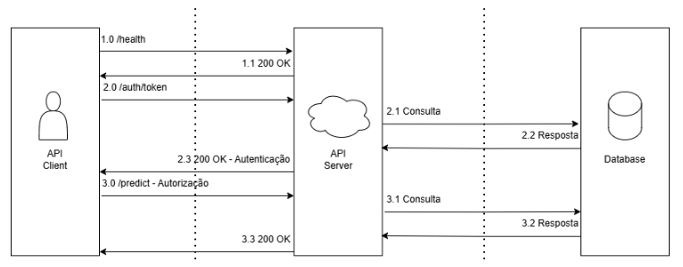
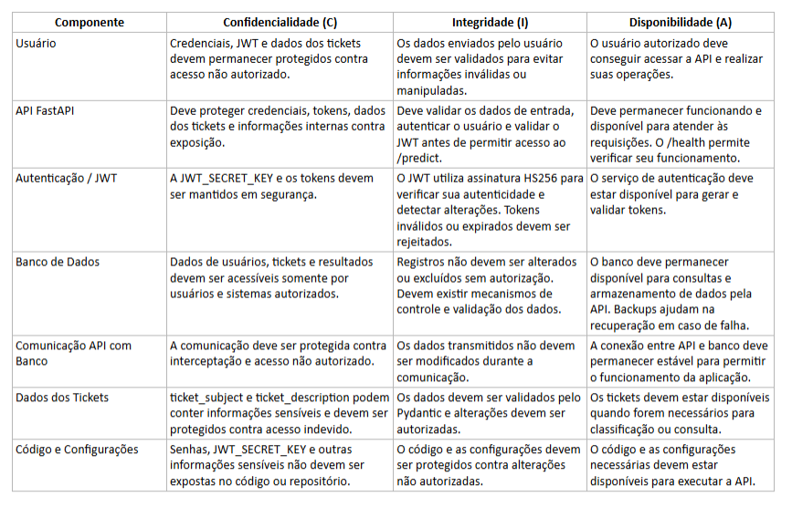

# Sistema de Atendimento ao Cliente com IA — Projeto de Bloco

Sistema de atendimento ao cliente alimentado por inteligência artificial: um agente que recebe a
mensagem de um cliente e infere a **intenção** por trás dela (problema técnico, cobrança, dúvida de
produto, reembolso, cancelamento). Ao final do bloco, o sistema construído será também **atacado**
(red team) para descobrir falhas de segurança — por isso a API já nasce com autenticação JWT.

## Estado atual (TP1)

| Etapa | Status |
|---|---|
| 1. Documentação técnica do dataset | ✅ Concluída (abaixo e no notebook) |
| 2. EDA completo (etapas 1.1–1.8: inspeção, qualidade, limpeza, univariada, multivariada, outliers, documentação) | ✅ Concluída — `eda/eda.ipynb` |
| 3. Hipóteses sobre as intenções dos usuários | ✅ Concluída — 5 exploratórias + 6 testes formais (Mann-Whitney e qui-quadrado) no notebook |
| 4. API FastAPI + JWT (`/health`, `/auth/token`, `/predict`) | ✅ Estrutura inicial — `fastapi/` |
| 5. DFD com trust boundaries + tríade CIA | ✅ Concluída — `others/` |
| 6. Hardening OWASP Top 10 na API (headers, CORS, rate limit, `extra=forbid`) | ✅ Concluída — `fastapi/SECURITY.md` |
| 7. Testes de segurança automatizados (pytest) | ✅ Concluída — `tests/test.py` |
| 8. Scan passivo com OWASP ZAP (findings médio/alto) | ✅ Concluída — `zap/` |

## Dataset: Customer Support Ticket Dataset

- **Fonte:** [Kaggle — suraj520/customer-support-ticket-dataset](https://www.kaggle.com/datasets/suraj520/customer-support-ticket-dataset)
- **Licença:** CC0: Public Domain (uso livre, inclusive comercial)
- **Arquivo:** `customer_support_tickets.csv` — 8.469 registros × 17 colunas (~3,9 MB)
- **Domínio:** tickets de suporte de produtos de tecnologia (laptops, smartphones, TVs, acessórios)
- **Alvo da classificação de intenção:** `Ticket Type` (5 classes balanceadas: technical issue,
  billing inquiry, product inquiry, refund request, cancellation request)
- **Texto para NLP:** `Ticket Subject` (16 assuntos) e `Ticket Description` (descrição longa)
- **Dimensões de contexto:** cliente (idade, gênero), produto (42), status, prioridade, canal,
  tempos de resposta/resolução, satisfação (1–5)
- **Natureza:** sintética — artefatos de geração identificados no EDA (placeholder
  `{product_purchased}` em 100% das descrições, janela de tickets de ~2,5 dias, resoluções
  anteriores a primeiras respostas em ~49% dos tickets fechados)

**Motivo da escolha:** aderência direta ao objetivo do bloco (texto livre + rótulo de intenção =
matéria-prima de um agente de IA), riqueza de dimensões de contexto, problema multiclasse
balanceado e realista, e licença CC0 compatível com repositório público.

## Estrutura de pastas (estado atual do desenvolvimento)

```
.
├── README.md                          # este arquivo
├── requirements.txt                   # dependências Python
├── .gitignore                         # ignora .venv/, caches e artefatos de kernel
├── data/
│   ├── customer_support_tickets.csv         # dataset original (Kaggle)
│   └── customer_support_tickets_clean.csv   # versão limpa (gerada pela célula de limpeza do EDA)
├── eda/
│   └── eda.ipynb                      # EDA completo — único .ipynb, já executado com gráficos embutidos
├── fastapi/                           # código-fonte da API (etapas 4 e 6)
│   ├── main.py                        # ponto de entrada (uvicorn main:app --reload)
│   ├── requirements.txt               # dependências da API e dos testes (isoladas das do EDA)
│   ├── .env.example                   # variáveis de ambiente esperadas (JWT_SECRET_KEY, ...)
│   ├── SECURITY.md                    # decisões de hardening OWASP Top 10
│   ├── routes/                        # endpoints: health, auth, predict
│   ├── models/                        # schemas Pydantic de entrada/saída
│   └── security/                      # JWT, OAuth2, headers, rate limit, ownership, usuários
├── tests/
│   └── test.py                        # testes de segurança da API (etapa 7)
├── zap/                               # scan passivo OWASP ZAP (etapa 8)
│   ├── scan_passivo_zap.md            # análise dos findings (severidade média e alta)
│   └── *.pdf                          # relatório bruto do ZAP e versão em PDF da análise
└── others/                            # DFD e CIA em .png (etapa 5)
    ├── CIA.png                        # análise CIA
    └── DFD.png                        # análise DFD
```

## Instalação

**Pré-requisitos:** Python 3.10+, git.

```bash
# 1. Clonar o repositório
git clone <url-do-repositorio>
cd <repositorio>

# 2. Criar ambiente virtual
python3 -m venv .venv
source .venv/bin/activate            # Linux/macOS

# 3. Instalar dependências
pip install -r requirements.txt
```

> O dataset original já está versionado em `data/`. Para (re)baixar da fonte:
> `python -c "import kagglehub; print(kagglehub.dataset_download('suraj520/customer-support-ticket-dataset'))"`

## Execução

### EDA (notebook)

```bash
source .venv/bin/activate
jupyter notebook eda/eda.ipynb
```

O notebook já é entregue executado (saídas e gráficos embutidos). Segue a estrutura pedida no TP:
(1) compreensão do problema e do dataset, (2) inspeção inicial, (3) verificação da qualidade dos
dados, (4) limpeza e preparação, (5) análise univariada, (6) análise multivariada, (7) hipóteses
exploratórias sobre as intenções, (8) identificação de outliers e anomalias, (9) testes de
hipótese formais e (10) documentação do EDA e conclusões. Atenção: reexecutar a célula de limpeza
regenera `data/customer_support_tickets_clean.csv` (incluindo as variáveis derivadas).

### API FastAPI

```bash
cd fastapi
python3 -m venv .venv
source .venv/bin/activate
pip install -r requirements.txt
cp .env.example .env
python3 -c "import secrets; print(secrets.token_hex(32))"   # gera um valor aleatório
# cole o valor gerado em JWT_SECRET_KEY dentro de .env
uvicorn main:app --reload
```

> Também defina `ALLOWED_ORIGINS` (origens de CORS autorizadas) e, opcionalmente,
> `AUTH_RATE_LIMIT_MAX_ATTEMPTS`/`AUTH_RATE_LIMIT_WINDOW_SECONDS` no `.env` — valores
> padrão e justificativa em [`fastapi/SECURITY.md`](fastapi/SECURITY.md).

Endpoints disponíveis (docs interativas em `http://127.0.0.1:8000/docs`):

- `GET /health` — verificação de disponibilidade, sem autenticação.
- `POST /auth/token` — login (`OAuth2PasswordRequestForm`: `username`/`password`) e emissão de
  token JWT. Usuário de demonstração: `admin` / `admin123` (base em memória, ver
  `security/users.py` — trocar por uma base real antes de produção).
- `POST /predict` — protegido por Bearer token; recebe `ticket_subject`/`ticket_description` e
  retorna a intenção prevista, dentre as 5 classes de `Ticket Type` do dataset (`Technical issue`,
  `Billing inquiry`, `Product inquiry`, `Refund request`, `Cancellation request` — ver
  `models/predict.py::Intent`). Ainda é um placeholder: a integração com o modelo de classificação
  será feita em etapa futura.

### Testes de segurança

Com o ambiente da API ativado (`fastapi/.venv`, que já inclui `pytest` e `httpx`), a partir da
raiz do repositório:

```bash
source fastapi/.venv/bin/activate
pytest tests/test.py -v
```

| Teste | Cenário | Esperado |
|---|---|---|
| `test_predict_without_token` | `POST /predict` sem `Authorization` | `401` |
| `test_cannot_access_resource_of_another_user` | `ensure_owner` com dono diferente do usuário autenticado | `404` (não revela existência do recurso) |
| `test_predict_rejects_extra_body_field` | body com campo extra (`is_admin`) | `422` (mass assignment bloqueado por `extra=forbid`) |

## Scan passivo OWASP ZAP (resumo)

Scan passivo da API local (`http://127.0.0.1:8000`) com OWASP ZAP. Análise completa em
[`zap/scan_passivo_zap.md`](zap/scan_passivo_zap.md) e relatório bruto em `zap/`.

| Finding | Severidade | Onde | Tratamento |
|---|---|---|---|
| Authentication Credentials Captured | High | `/auth/token` | HTTP apenas em ambiente local; HTTPS obrigatório antes de qualquer implantação |
| Content Security Policy Header Not Set | Medium | `/docs` | Risco aceito em desenvolvimento; CSP recomendada se `/docs` for exposto |
| Cross-Domain Misconfiguration | Medium | CDN jsDelivr (Swagger UI) | Risco de terceiro — o CORS da própria API é restritivo (`ALLOWED_ORIGINS`) |
| Sub Resource Integrity Attribute Missing | Medium | `/docs` (Swagger UI) | Risco aceito enquanto `/docs` não for público em produção |

## Hipóteses sobre as intenções dos usuários (resumo)

1. **Intenções equilibradas** — 5 classes entre 19,3% e 20,7%: não há intenção dominante;
   classificador multiclasse balanceado (baseline ≈ 20%).
2. **Prioridade não reflete intenção real de urgência** — ~50% dos tickets `High`/`Critical`
   vs. 33% fechados: urgência declarada é inflada/aleatória.
3. **Contato majoritariamente textual e digital** — ~75% por Email/Chat/Social media: valida
   agente baseado em NLP sobre texto.
4. **A intenção depende do tipo de problema, não do produto** — 42 produtos, top-1 ≈ 2,8%:
   o modelo generaliza sem features de produto.
5. **Texto bruto insuficiente para inferir intenção** — 100% das descrições com placeholder e
   ~69% em template fixo: risco de overfitting lexical; usar `Subject`/`Type` como sinal central.

Detalhamento completo, com as estatísticas que sustentam cada hipótese, no notebook
(`eda/eda.ipynb`, Seção 7).

## Testes de hipótese formais (resumo)

As hipóteses foram submetidas a testes formais (α = 0,05, Seção 9 do notebook). Como as
numéricas violam normalidade (Shapiro p < 1e−4; idade uniforme; satisfação ordinal), as
comparações usam **Mann-Whitney U** (com t de Welch como robustez) e os testes de
uniformidade/independência usam **qui-quadrado**:

| Hipótese | Teste | p | Conclusão |
|---|---|---|---|
| H1 · Satisfação de `Technical issue` < `Billing inquiry` | Mann-Whitney (unilateral) | 0,208 | Não rejeita H0 (efeito +0,03) |
| H2 · Usuários de Chat mais jovens que de Phone | Mann-Whitney (unilateral) | 0,351 | Não rejeita H0 (efeito +0,01) |
| H3 · Duração da resolução difere Phone × Email | Mann-Whitney (bilateral) | 0,230 | Não rejeita H0 (efeito +0,04) |
| H4 · Satisfação difere entre prioridades alta × baixa | Mann-Whitney (bilateral) | 0,418 | Não rejeita H0 (efeito +0,02) |
| H5 · Hora da 1ª resposta é uniforme | χ²(23) de aderência | **0,026** | **Rejeita H0** — leve pico às 19h |
| H6 · `Ticket Subject` ⊥ `Ticket Type` | χ²(60) de independência | 0,981 | Não rejeita H0 — **rótulos independentes** |

**Interpretação:** os quatro testes de comparação têm efeitos desprezíveis (|rank-biserial| ≤
0,04) — prioridade, canal e idade não carregam sinal, confirmando formalmente a natureza
sintética do dataset. As duas estruturas detectadas são artefatos (pico vespertino dentro de uma
janela de 2,5 dias; independência total entre as duas camadas de rótulo). Implicação para a
modelagem: **não usar `Ticket Subject` como preditor de `Ticket Type`** e não confiar em
metadados — o modelo deve apoiar-se no texto normalizado da descrição.

## DFD


## CIA


## Licença

- Dataset: CC0: Public Domain.
- Código deste repositório: para fins acadêmicos do Projeto de Bloco.
